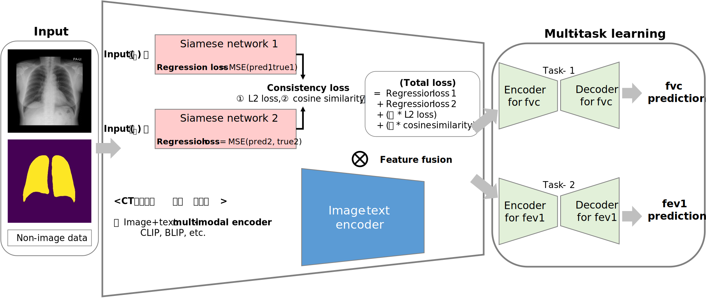

# SiamCXR: Siamese multimodal deep learning for CXR-based PFT prediction

This repository provides a **Siamese multimodal deep learning framework** for predicting **pulmonary function tests (PFT)** from **chest X-ray (CXR)** images and non-imaging clinical variables.

The proposed model leverages **longitudinal chest X-ray pairs** from the same patient using a Siamese Network to effectively capture temporal changes, while integrating clinical metadata to improve pulmonary function prediction performance.

---

## Model Overview

The model is designed to predict pulmonary function indices (e.g., FEV1, FVC) from chest X-ray images by jointly learning imaging and non-imaging features.

### Architecture


- **Imaging branch**
  - CNN-based backbone (**ResNet-18**) for CXR feature extraction
  - **CBAM attention module** to enhance spatial and channel-wise representations
  - Supports both single-timepoint and longitudinal CXR inputs

- **Non-imaging branch**
  - Clinical variables (age, sex, height, lung area)
  - Processed through a fully connected layer

- **Multimodal fusion**
  - Imaging and clinical features are concatenated and fed into a regression head for PFT prediction

- **Siamese Network**
  - Paired CXRs from the same patient at different time points
  - **Consistency loss** encourages temporally coherent predictions across longitudinal inputs

---

## Data Augmentation

For single-timepoint CXR data, the following augmentation strategies are applied:
- Rotation
- Pixel translation
- Gaussian noise injection
- Contrast adjustment

This allows the model to operate robustly with both single and repeated imaging data.

---

## Key Features

- Siamese learning for longitudinal CXR analysis
- Multimodal fusion of imaging and clinical data
- Attention-based feature refinement
- Flexible design supporting single and repeated measurements

---

## Environment Setup

```bash
pip install -r requirements.txt
